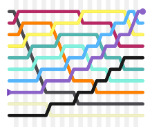

# SRTVIZ - A simple sorting algorithm visualizer



My goal in this project is a real-time visualizer for sorting algorithms. The implementation of algorithms is self-made, and the visualization is done using SFML. The project is still in development, and I will add more algorithms and features in the future.

## Features
- Real-time visualization of sorting algorithms
- User can choose the algorithm to visualize
- User can choose the size of the array to sort
- Random array generation

## Algorithms
- Bubble sort
- Selection sort
- Insertion sort
- More to come...

## How to use
```bash
# Make sure dependencies are installed
# SMFL: https://www.sfml-dev.org/tutorials/2.5/start-linux.php

# Clone the repository
git clone https://github.com/tory1103/srtviz.git

# Create a build directory
mkdir build
cd build

# Build the project
cmake ..
make

# Run the project
./srtviz
```

## Dependencies
- SFML
- CMake
- Make
- GCC
- Git